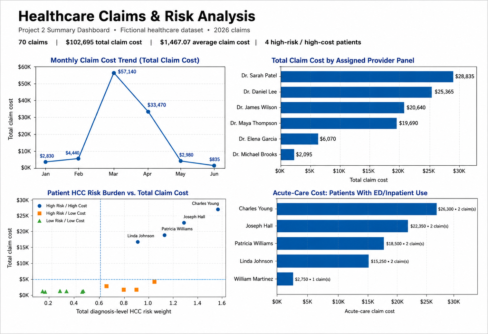

# Healthcare Claims & Risk Analysis

## Project Overview

This project analyzes a fictional healthcare dataset to explore relationships between patient clinical risk, healthcare utilization, claim costs, and provider patient panels.

Using MySQL, I developed a series of analytical queries that progress from foundational patient-level summaries to more advanced risk stratification, provider-level analysis, monthly trend analysis, and patient risk-cost segmentation.

The project is designed to demonstrate how SQL can be used to transform healthcare claims and diagnosis data into actionable insights that could support population health, risk adjustment, clinical documentation improvement, and value-based care analytics.

> **Note:** All patient, provider, diagnosis, and claims data in this project are fictional and were created solely for portfolio and educational purposes.

---

## Business Objectives

The analysis was designed to answer several healthcare-focused business questions:

- Which patients have the greatest documented diagnosis burden?
- Which patients have the highest total HCC risk weight?
- Which patients generate the highest overall claim costs?
- Which patients demonstrate both above-average clinical risk and above-average healthcare costs?
- How does average patient risk vary across provider panels?
- How do patients rank by risk within their assigned provider's panel?
- Which patients are utilizing higher-cost acute-care services such as emergency department and inpatient care?
- How do claim volume and claim costs change over time?
- How do healthcare utilization and costs vary across provider panels?
- How can patients be segmented into risk and cost categories for population-level analysis?

---

## Dataset Structure

The fictional relational dataset contains four primary tables:

### `Providers`
Contains information about the healthcare providers represented in the dataset.

Key fields include:
- `provider_id`
- `provider_name`
- `specialty`
- `clinic_name`

### `Patients`
Contains patient demographic information and assigns each patient to a provider.

Key fields include:
- `patient_id`
- `patient_name`
- `age`
- `gender`
- `provider_id`

### `Conditions`
Contains patient diagnosis information and fictional HCC-related risk weights.

Key fields include:
- `condition_id`
- `patient_id`
- `condition_name`
- `hcc_category`
- `risk_weight`

### `Claims`
Contains healthcare claim and utilization information.

Key fields include:
- `claim_id`
- `patient_id`
- `claim_date`
- `claim_type`
- `claim_amount`

The dataset contains:

- **6 providers**
- **20 patients**
- **45 documented conditions**
- **70 healthcare claims**

---

## SQL Analysis

The project contains 10 analytical queries.

### Query 1 — Patient Condition Burden

**Business Question:**  
How many documented conditions does each patient have?

This analysis uses a `LEFT JOIN`, `COUNT()`, and `GROUP BY` to calculate each patient's documented condition burden while retaining the patient population.

---

### Query 2 — Patient HCC Risk Burden

**Business Question:**  
What is the total diagnosis-level HCC risk weight associated with each patient?

Risk weights from the Conditions table are aggregated at the patient level to identify patients with greater documented clinical risk burden.

---

### Query 3 — Patient Claims Utilization & Cost

**Business Question:**  
How many claims does each patient have, and what is the total cost of those claims?

This query combines claim frequency and total claim spending to identify patients with greater healthcare utilization and financial impact.

---

### Query 4 — High-Risk / High-Cost Patients

**Business Question:**  
Which patients have both above-average HCC risk burden and above-average total claim cost?

Common Table Expressions (CTEs) are used to separately calculate patient risk, patient cost, and population averages before identifying patients exceeding both benchmarks.

---

### Query 5 — Provider Panel Risk

**Business Question:**  
What is the average patient HCC risk burden within each provider's patient panel?

Patient-level risk is first calculated before being aggregated at the provider level, allowing provider panels to be compared based on average patient risk.

---

### Query 6 — Patient Risk Rank Within Provider Panel

**Business Question:**  
How does each patient's diagnosis-level HCC risk burden rank within their assigned provider's patient panel?

`DENSE_RANK()` and `PARTITION BY` are used to rank patients within each provider panel while appropriately handling patients with identical risk values.

---

### Query 7 — Acute-Care Utilization

**Business Question:**  
Which patients are utilizing emergency department or inpatient services, and what are the associated costs?

Conditional aggregation using `CASE` statements separates:

- Emergency department claims
- Inpatient claims
- Combined acute-care claims
- Total acute-care cost

This provides a patient-level view of potentially higher-cost healthcare utilization.

---

### Query 8 — Monthly Claims Trends

**Business Question:**  
How do claim volume, total claim cost, and average claim cost change by month?

Claims are aggregated by month to evaluate changes in:

- Claim volume
- Total claim spending
- Average claim cost
- Month-over-month claim cost

The `LAG()` window function is used to compare each month's spending with the previous month.

---

### Query 9 — Provider Claims & Cost Analysis

**Business Question:**  
How do claim volume and healthcare costs vary across provider patient panels?

This analysis compares provider panels using:

- Panel size
- Total claims
- Total claim cost
- Average claim cost

This creates a provider-level view of utilization and financial performance.

---

### Query 10 — Patient Risk-Cost Segmentation

**Business Question:**  
How can patients be segmented based on whether their diagnosis-level HCC risk burden and total claim cost are above or below the population average?

Patients are classified into four analytical segments:

- **High Risk / High Cost**
- **High Risk / Low Cost**
- **Low Risk / High Cost**
- **Low Risk / Low Cost**

This type of segmentation can help identify populations that may warrant additional analysis or targeted intervention in a value-based care environment.

---

## Key Findings

Several patterns emerged from the fictional dataset:

- The dataset contains **70 claims totaling $102,695** in healthcare spending.
- Average claim cost across the dataset is approximately **$1,467.07**.
- **March 2026** had the highest monthly claim cost at **$58,140**.
- Monthly claim spending increased substantially from February to March before declining in subsequent months.
- **4 patients** were classified as **High Risk / High Cost** based on above-average diagnosis-level HCC risk burden and total claim cost.
- Charles Young had the highest diagnosis-level HCC risk burden in the dataset and also had the highest acute-care cost.
- Dr. Sarah Patel's assigned patient panel generated the highest total claim cost at **$28,835**.
- Dr. Maya Thompson's assigned patient panel generated the greatest claim volume with **16 claims**.
- Provider panels with greater claim volume did not necessarily have the highest total or average claim cost, demonstrating the importance of evaluating both utilization and financial measures.

---

## Dashboard

The summary dashboard highlights four major areas of the analysis:

1. Monthly claim cost trends
2. Total claim cost by assigned provider panel
3. Patient HCC risk burden versus total claim cost
4. Acute-care costs among patients with emergency department or inpatient utilization

### Healthcare Claims & Risk Analysis Dashboard

[View the full-size dashboard](claims_risk_dashboard.png)

---

## SQL Skills Demonstrated

This project demonstrates practical use of:

- `SELECT`
- `WHERE`
- `GROUP BY`
- `ORDER BY`
- `COUNT()`
- `SUM()`
- `AVG()`
- `ROUND()`
- `COALESCE()`
- `CASE`
- `LEFT JOIN`
- `JOIN`
- `CROSS JOIN`
- Common Table Expressions (CTEs)
- Conditional aggregation
- `DATE_FORMAT()`
- Window functions
- `LAG()`
- `DENSE_RANK()`
- `PARTITION BY`
- Multi-level patient and provider aggregation
- Population benchmark comparisons

---

## Healthcare Analytics Applications

The analytical techniques demonstrated in this project are applicable to areas such as:

- Population health analytics
- Value-based care
- Medicare Advantage analytics
- Risk adjustment
- Clinical documentation improvement
- Healthcare utilization analysis
- Provider performance analysis
- Patient risk stratification
- Cost and utilization trend analysis

---

## HCC Risk Methodology Note

The `risk_weight` values used in this project are fictional diagnosis-level weights created for analytical practice.

The summed `total_hcc_risk_weight` values used throughout the analysis should **not** be interpreted as complete CMS Risk Adjustment Factor (RAF) scores.

Actual CMS risk adjustment calculations incorporate additional factors, including demographic components, disease interactions, model-specific coefficients, eligibility characteristics, and applicable CMS-HCC model methodology.

The HCC-related measures in this project are therefore intended to demonstrate SQL-based healthcare risk analysis rather than reproduce official CMS risk scoring.

---

## How to Run the Project

This project was developed using **MySQL**.

### 1. Create the dataset

Run:

`sample_data.sql`

This script creates and populates the Providers, Patients, Conditions, and Claims tables.

### 2. Run the analysis

After the sample dataset has been created, run:

`claims_risk_analysis.sql`

The file contains all 10 analytical queries used in this project.

### 3. Review the dashboard

The completed summary visualization is available as:

`claims_risk_dashboard.png`

---

## Project Files

| File | Description |
|---|---|
| `sample_data.sql` | Creates and populates the fictional healthcare dataset |
| `claims_risk_analysis.sql` | Contains the 10 SQL analytical queries |
| `claims_risk_dashboard.png` | Visual summary of key analytical findings |
| `README.md` | Project documentation, methodology, and findings |

---

## Tools Used

- **MySQL** — Query development and analysis
- **db<>fiddle** — Query testing and validation
- **Visual Studio Code** — SQL development and project organization
- **Git / GitHub** — Version control and portfolio hosting

---

## Project Purpose

This project was created as part of a healthcare SQL portfolio to demonstrate the ability to translate healthcare business questions into structured SQL analyses.

The project progresses from foundational aggregation and joins into more advanced analytical techniques such as CTEs, conditional aggregation, population benchmarking, patient segmentation, and SQL window functions.