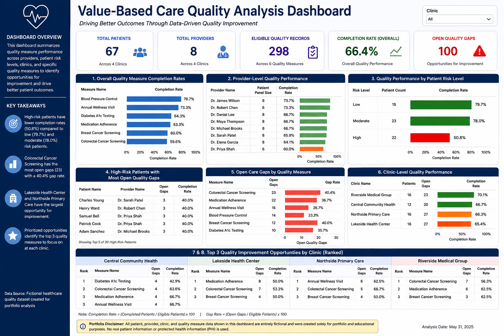

# Value-Based Care Quality Analysis

## Project Overview

This project analyzes a fictional healthcare quality dataset to evaluate quality measure performance, identify open care gaps, compare performance across patient risk levels, and prioritize quality improvement opportunities across providers and clinic locations.

The analysis is designed to demonstrate how SQL can be used to translate healthcare quality data into actionable insights for value-based care, population health, and quality improvement initiatives.

All patient, provider, clinic, and quality measure data used in this project are entirely fictional and were created solely for portfolio and educational purposes. No real patient information or protected health information (PHI) is used.

---

## Dashboard

The dashboard summarizes key findings from the SQL analysis, including overall quality measure performance, provider-level performance, patient risk segmentation, open care gaps, clinic-level performance, and prioritized improvement opportunities.

---

## Business Questions

This analysis was designed to answer eight healthcare quality and operational questions:

1. What percentage of eligible patients completed each quality measure?
2. Which providers have the highest and lowest overall quality measure completion rates?
3. How do quality measure completion rates differ across patient risk levels?
4. Which high-risk patients have the greatest number of open quality gaps requiring potential outreach?
5. Which quality measures have the greatest number of incomplete patient care gaps?
6. How does overall quality measure performance vary across clinic locations?
7. Which quality measures contribute the most open care gaps within each clinic?
8. What are the highest-priority quality improvement opportunities within each clinic?

---

## Key Findings

### Quality Measure Performance

Blood Pressure Control had the highest overall completion rate at **76.7%**, followed by Annual Wellness Visits at **73.3%**.

Colorectal Cancer Screening had the lowest completion rate at **59.6%** and the largest number of open quality gaps, with **23 open gaps** and a **40.4% gap rate**.

Medication Adherence represented another significant opportunity, with **22 open gaps** and a **36.7% gap rate**.

These results demonstrate how both completion rates and absolute gap volume can be considered when prioritizing quality improvement efforts.

### Patient Risk and Quality Performance

Quality measure completion varied substantially across patient risk levels:

- Low-risk patients: **79.7%**
- Moderate-risk patients: **78.0%**
- High-risk patients: **50.8%**

The considerably lower completion rate among high-risk patients identifies an important opportunity for targeted outreach and care coordination.

High-risk patients may also have more complex clinical needs competing for limited visit time, making systematic gap identification particularly important for this population.

### Provider Performance

Provider-level completion rates ranged from **60.0% to 73.7%**.

Evaluating provider performance alongside patient panel size and patient risk can help identify opportunities for targeted workflow support, provider education, and population health interventions rather than relying on completion percentages alone.

### Clinic-Level Opportunities

Clinic completion rates ranged from **65.4% to 70.1%**.

Riverside Medical Group demonstrated the highest overall completion rate at **70.1%**.

Northside Primary Care and Lakeside Health Center each had **27 open quality gaps**, representing the largest absolute opportunities for gap closure among the four clinics.

Central Community Health had a similar overall completion rate but fewer open gaps because of its smaller patient population, demonstrating why both rates and absolute gap counts are important when evaluating operational performance.

### Prioritized Quality Improvement

The analysis ranks the highest-priority quality measures within each clinic based on open care gaps and completion performance.

This type of prioritization can help population health and quality teams determine where outreach and operational resources may have the greatest impact.

Quality improvement strategies should also consider measure-specific eligibility requirements, timing, patient engagement, and clinical workflows when determining which gaps can reasonably be addressed.

---

## SQL Techniques Demonstrated

This project demonstrates:

- Multi-table JOINs
- GROUP BY and aggregate functions
- COUNT and COUNT DISTINCT
- Conditional aggregation using CASE statements
- Common Table Expressions (CTEs)
- Window functions
- DENSE_RANK()
- Patient and provider segmentation
- Rate calculations
- Multi-level healthcare performance analysis
- Business-oriented query design

---

## Dataset Structure

The fictional relational dataset contains five tables:

### Providers
Contains provider identifiers, provider names, specialties, and clinic assignments.

### Patients
Contains fictional patient demographic information, assigned providers, and patient risk levels.

### Encounters
Contains fictional patient encounter information used to represent healthcare utilization.

### QualityMeasures
Defines the quality measures and their corresponding measure categories.

### PatientQuality
Connects patients with eligible quality measures and identifies whether each measure was completed.

---

## Files

- `sample_data.sql` — Creates the database tables and populates the fictional dataset
- `quality_analysis.sql` — Contains the eight SQL analyses used throughout the project
- `value_based_care_quality_dashboard.png` — Visual summary of the major analytical findings
- `README.md` — Project documentation and interpretation

---

## Healthcare Application

This project demonstrates an analytical workflow applicable to healthcare quality improvement and value-based care environments.

The analysis moves beyond simply reporting quality measure completion rates by identifying:

- High-risk patients with unresolved care gaps
- Providers with opportunities for quality improvement
- Clinics with the greatest absolute gap-closure opportunities
- Quality measures contributing disproportionately to open gaps
- Clinic-specific priorities for targeted intervention

These insights can support population health outreach, provider education, operational planning, care-gap closure initiatives, and performance improvement efforts.

---

## Portfolio Disclaimer

All patient names, provider names, clinic names, healthcare records, and quality measure results contained in this project are entirely fictional and were created solely for portfolio and educational purposes.

No real patient information or protected health information (PHI) is used.

This project is intended to demonstrate SQL, healthcare analytics, and data interpretation skills and should not be interpreted as analysis of actual CMS, payer, provider, or patient data.